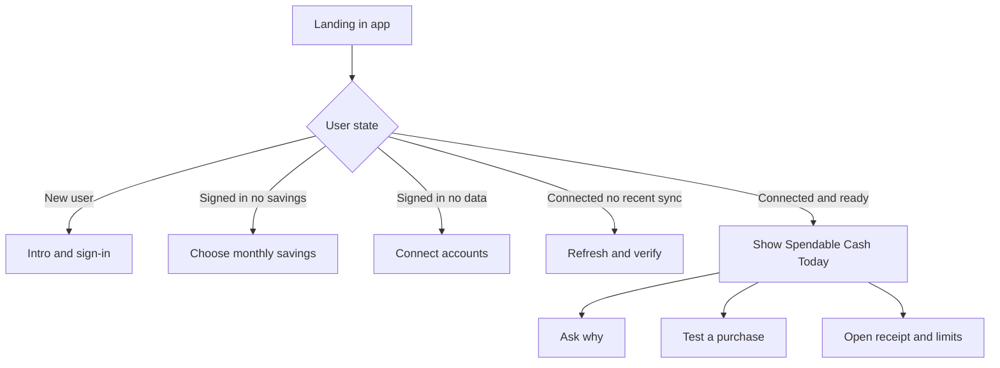

# Pip Copywriting Guide

## Executive summary

Pip is positioned as a **paid, read-only, “daily money companion”** whose core promise is not budgeting, forecasting, or financial advice, but answering one narrow question before a purchase: **“What can I actually use today?”** The official site and repository repeatedly frame the product around **“Spendable Cash Today,” “one calm number,” “before you spend,”** and a deliberate rejection of budget dashboards, spreadsheet upkeep, and category management. The product also makes a strong trust claim: Pip is paid precisely so user financial data does not need to be monetized via ads or resale. citeturn46view0turn48view0turn39view0turn44view3turn39view2

The highest-confidence target user is not defined demographically in the sources. No official age, income, life-stage, or household segment is specified. What *is* clear is the behavioral target: people who already check their bank balance before spending, dislike maintaining budgets, and want a faster, calmer, lower-cognitive-load money decision aid. That inference is directly supported by the messaging about replacing the “bank-balance-as-permission” habit with a better default number, and by copy aimed at users who “do not want a budget, dashboard, or spreadsheet.” citeturn46view0turn47view0turn47view2turn36view2

From a strategic copy perspective, Pip’s advantage is **focus**. Most competitors promise broad money management: budgeting, net worth, subscriptions, goals, collaboration, or debt payoff. Pip’s sharper lane is **instant spending clarity**, with just enough conversational depth to explain the number or test a purchase. That makes the strongest positioning frame: **not another finance control center, but a decision-support habit for the next spend.** citeturn46view0turn48view2turn8search4turn10search4turn22search2turn23search1

Two tensions need active copy management. First, the brand uses pleasingly soft language—“calm,” “cute,” “friendly”—but it is also handling sensitive financial context, so the copy must keep trust cues explicit and frequent. Second, some public copy says “what is actually okay to use today,” while the repo includes a language-boundary test that bans “safe to spend” phrasing; that suggests Pip is already sensitive to overclaim risk, and the public copy should be tightened to avoid drifting from “decision support” into implied certainty. citeturn48view1turn39view2turn39view1turn47view1

## Product positioning and current messaging analysis

The current positioning is unusually disciplined. The homepage headline, the site metadata, and the repository all converge on the same conceptual unit: **one daily number before you spend**. The product explains the problem as a mismatch between the visible bank balance and the *useful* spending signal, then offers Spendable Cash Today as the corrective. The value proposition is therefore not “track everything,” but **reduce money noise into a usable default**. citeturn46view0turn45view1turn39view0turn49view0

The tone is best described as **calm, plainspoken, emotionally intelligent, anti-shaming, and gently anthropomorphic**. Repeated phrases such as “one calm number,” “tiny money habits, no homework,” and “cute does not mean careless” create a voice that is warmer than typical fintech copy, but still anchored by operationally concrete trust language like “read-only,” “cannot move money,” and “server-side credentials.” This is a good strategic mix: it softens a stressful domain without becoming glib. citeturn46view0turn48view1turn39view2

The strongest current value props are consistent across the site and repo. They cluster into six themes: **better default than bank balance**, **one-number simplicity**, **read-only trust**, **monthly savings protection**, **explanatory chat**, and **paid-no-ads economics**. Those claims appear on the home page, pricing page, security page, mechanics page, repository README, and product-access files. citeturn46view0turn48view0turn48view1turn48view2turn39view0turn44view3turn45view0

The CTA system is simple and coherent. The dominant CTA is **“Get Pip.”** Secondary CTAs include **“See how it works,” “Read security details,” “Read the blog,”** and **“View pricing.”** That hierarchy makes sense for a trust-sensitive product: primary action first, then explanation and proof for users who need reassurance before connecting accounts or paying. citeturn46view0turn48view0turn48view1

The onboarding copy in the app source is already directionally strong. It is short, second-person, and sequential: **“Hi, I’m Pip. I’ll help you find what’s okay to spend today.”** Then: **“First we’ll sign in. Then we’ll choose monthly savings and connect data.”** The savings step is concrete and trust-building: **“Pick how much you want Pip to keep out of your daily spending number each month”** and **“You can change this later. Pip does not move money.”** The ready-state handoff keeps effort low: **“Connect data”** and **“I’ll open Plaid, then we’ll move into chat.”** citeturn41view1turn41view2turn43view1

The microcopy style is compact and mostly effective. The composer placeholder is **“Ask Pip anything…”** with explicit button labeling via **“Send.”** Prompt chips are visually capped at three items, reinforcing the small-surface philosophy. The post-connection notice is crisp: **“Plaid connected”** and **“Your account data connected successfully. I’m using it here to calculate Spendable Cash Today.”** Those are strong examples of interaction-copy restraint. citeturn43view3turn43view2turn41view0

The main messaging risks are not structural; they are precision risks. The product says it is “decision support,” “not a guarantee,” and “not financial advice,” which is good. But public educational content still uses softer certainty-adjacent language such as **“actually okay to use today.”** Because the repo explicitly bans “safe to spend” wording, Pip should standardize around **“spending room,” “decision support,”** and **“useful today signal,”** not “okay,” “safe,” or any phrasing that implies certainty or approval. citeturn47view1turn39view1turn39view2

## Competitive landscape

Pip’s clearest competitive whitespace is that it **compresses the job-to-be-done** more aggressively than the rest of the field. Monarch, Copilot, Rocket Money, YNAB, and PocketGuard all try to give broader financial control. Pip should not chase that breadth in copy. It should lean harder into **pre-purchase clarity** and **a smaller cognitive footprint**. citeturn10search4turn22search2turn9search0turn8search8turn8search4

| App | Core promise | Tone | Key public messages | Public onboarding CTA |
|---|---|---|---|---|
| **Pip** | One calm daily number before you spend | Warm, calm, minimal, trust-forward | Spendable Cash Today; not another budget app; read-only; paid so your data is not the product | **Get Pip** |
| **Monarch** | All-in-one money management and planning | Modern, confident, household-control oriented | All accounts in one place; budgeting, goals, collaboration, future planning | **Get started for free / Start free trial** |
| **Copilot** | Beautiful, simple money clarity across accounts | Premium, design-led, reassuring | Clear, beautiful, trusted; budgeting, subscriptions, net worth; less work than Mint | **Download / start using Copilot** |
| **PocketGuard** | Know what you have left after bills and goals | Practical, utility-led, somewhat direct-response | Leftover money; know where your money goes; improve financial control | **Join / download PocketGuard** |
| **YNAB** | Give every dollar a job and never worry about money again | Evangelical, motivational, method-led | Method over app; reduce money stress; clarify priorities | **Try free / Start your free one-month trial** |
| **Rocket Money** | Save more, spend less, see everything | Mass-market, energetic, benefit-stack heavy | Track subscriptions, spending, budgets, savings, bills, net worth | **Take control of my finances** |

Source notes for the table: Pip’s framing comes from the official site and repo. Monarch emphasizes “all-in-one” money management, budgeting, goals, and collaboration. Copilot emphasizes “clear, beautiful, trusted” money clarity with auto-categorization and less work. PocketGuard centers “Leftover Money” and “know where your money goes.” YNAB leads with “give every dollar a job” and “never worry about money again.” Rocket Money leads with “save more, spend less, see everything, and take back control.” citeturn46view0turn48view0turn39view0turn10search4turn10search8turn22search4turn22search2turn8search4turn22search1turn22search7turn8search8turn23search1turn9search0turn22search3

The practical implication is straightforward. Pip should avoid category-table-stakes language like **manage your finances**, **track everything**, **reach your goals faster**, or **all-in-one**. That territory is crowded and weakens Pip’s strongest difference. Instead, Pip should compete on three axes the others do not own as tightly: **speed to answer, emotional relief, and narrowness of purpose**. citeturn46view0turn49view0turn10search4turn9search0turn8search8

## Recommended voice and tone guidelines

Pip’s best voice is **calm, specific, and human**, with enough warmth to lower money anxiety and enough precision to maintain trust. That aligns not only with Pip’s own current direction, but also with Apple’s guidance that onboarding should be fast, focused, optional, and ideally taught through interaction, and with Microsoft and Google guidance favoring friendly, clear, jargon-light, concise writing. citeturn12search2turn12search4turn14search0turn14search4turn19search5turn19search1

**Voice rules**

| Dimension | Recommended standard |
|---|---|
| Personality | Calm, clear, kind, lightly companion-like |
| Stance | Helpful guide, not authority figure |
| Emotional register | Quiet confidence, no shame, no scolding |
| Trust posture | Explicit boundaries, no hand-waving |
| Reading level | Roughly grade 5–7 for UI; grade 7–9 for marketing explainers |
| Sentence length | UI: 4–12 words preferred. Marketing body: average 12–18 words |
| Grammar style | Active voice, second person, contractions okay |
| Vocabulary | Everyday money words; avoid fintech jargon unless defined |

**Do**
- Lead with the next user decision.
- Use concrete nouns: **balance, bills, savings, account, today, purchase**.
- Explain limits without sounding defensive.
- Use second person and present tense.
- Repeat core product nouns consistently: **Pip**, **Spendable Cash Today**, **monthly savings**, **read-only**, **Ask Pip**.
- Prefer short, mobile-readable lines. citeturn14search0turn14search5turn19search5turn19search2turn12search4

**Do not**
- Use certainty-heavy phrases like **safe to spend**, **approved to spend**, **guaranteed**, or **you’re good**.
- Drift into regulated-advice territory such as **what you should do financially**.
- Overpromise intelligence with words like **understands everything** or **knows all your bills**.
- Sound cute during risk, trust, billing, privacy, or error moments.
- Use heavy fintech language like **cash-flow optimization**, **liquidity**, or **predictive discretionary capacity**. citeturn39view1turn39view2turn44view0turn19search1turn14search1

**Preferred vocabulary**
- Use: **spending room, daily number, read-only connection, monthly savings, what changed, what’s coming up, today’s number, use today, decision support**
- Avoid: **safe-to-spend, affordability guarantee, approval, optimization, wealth stack, financial operating system**

That vocabulary keeps Pip distinct from both budgeting orthodoxy and fintech jargon while staying aligned with the repo’s own language-boundary tests. citeturn39view1turn46view0turn49view0

## Messaging framework and sample copy

Pip’s messaging should be organized around one message hierarchy:

| Layer | Message |
|---|---|
| Core promise | Before you spend, check one better number |
| Problem | Your bank balance shows what exists, not what is already spoken for |
| Mechanism | Pip turns connected balances, transactions, savings settings, and visible commitments into Spendable Cash Today |
| Emotional payoff | Less guessing, less guilt, less dashboard fatigue |
| Trust frame | Read-only, no money movement, direct paid model, no ads, no data selling |
| Expansion path | Ask Pip why the number changed or what a purchase would do |

That framework is already present in the official site, pricing, mechanics, and trust files; the job now is to make it more repeatable and more legally tight. citeturn46view0turn48view0turn48view1turn48view2turn39view2

### Headline formulas

Use these as repeatable patterns for web, paid ads, app-store assets, and onboarding:

| Formula | Example |
|---|---|
| Before-action + better default | **Before you spend, check Pip.** |
| Old behavior vs better signal | **Same check. Better number.** |
| Problem reframed | **Your balance is not all open room.** |
| Daily-question framing | **How much room do I have today?** |
| Anti-category contrast | **One daily number, not a budget spreadsheet.** |
| Trust-led differentiation | **Check one number without giving Pip control of your money.** |

### Feature-to-benefit statements

| Feature | Benefit copy |
|---|---|
| Spendable Cash Today | **See one useful number for today’s next spending decision.** |
| Read-only account connection | **Get context from your accounts without giving Pip the power to move money.** |
| Monthly savings setting | **Protect the amount you want held out of everyday spending decisions.** |
| Purchase checks | **Ask “Can I spend $50?” instead of doing the math in your head.** |
| Ask Pip explanations | **When the number changes, get the why without digging through a dashboard.** |
| Trust receipt | **See freshness, account coverage, and known limits beside the number.** |
| Paid model | **Use a money app whose incentives come from your subscription, not your data.** |
| Minimal default screen | **Open the app and decide faster instead of managing categories first.** |

These recommendations mirror the shipped features and trust boundaries already exposed on the site and in repo sources. citeturn44view3turn48view2turn48view1turn39view2

### Recommended onboarding flows

| Flow | Goal | Suggested copy snippet |
|---|---|---|
| Intro | Establish value fast | **Hi, I’m Pip. I’ll help you find your spending room for today.** |
| Sign-in | Reduce perceived setup friction | **First, sign in so I can keep your number and settings with you.** |
| Savings setup | Frame savings as protected, not punitive | **Choose what you want kept out of today’s number each month. You can change this later.** |
| Account connection | Convert trust hesitation | **Connect read-only accounts so Pip can turn your balance into a better daily signal.** |
| First ready state | Reinforce habit | **You’re set. Before the next purchase, check this number first.** |
| Explanation path | Turn curiosity into usage | **If the number surprises you, ask what changed.** |

### Push and notification examples

| Use case | Example |
|---|---|
| Morning habit | **Before you spend today, check Pip first.** |
| Bill posted | **Today’s number moved. Your phone bill posted this morning.** |
| Lower-than-usual room | **Today looks tighter than usual. Open Pip before the next purchase.** |
| Positive update | **You’ve got more room today than yesterday. Want the why?** |
| Missed connection | **Your account connection may need attention. Today’s number could be incomplete.** |
| End-of-day reflection | **Quick check: do you want to protect more for monthly savings?** |
| Purchase prompt | **Biggish purchase coming? Ask Pip before you buy.** |
| Refresh reminder | **New transactions are in. Your daily number is updated.** |
| Re-engagement | **No homework. Just one number before the next spend.** |
| Value reminder | **Your balance shows what exists. Pip shows today’s spending room.** |

### In-app microcopy examples

| Surface | Recommended copy |
|---|---|
| Metric sublabel | **Today’s spending room** |
| Savings helper | **Held out before today’s number** |
| Connection helper | **Read-only account data** |
| Receipt warning | **This number may be incomplete because one account is missing or stale.** |
| Purchase test input | **Ask about a purchase** |
| Empty state | **Connect accounts to turn your balance into a better daily number.** |

### A/B tests

| Test | Variant idea | Hypothesis | Primary metric |
|---|---|---|---|
| Hero line | “Before you spend, check Pip” vs “One calm number before you spend” | The action-led headline will lift clickthrough more than the descriptive one | Hero CTA CTR |
| Subhead framing | “Stop guessing from your bank balance” vs “See today’s spending room” | Problem-first framing will improve landing-page conversion | Get Pip CTR / app opens |
| Savings step label | “Monthly savings” vs “Protected monthly savings” | The protection frame will improve completion by making the benefit clearer | Savings-step completion |
| Connect step explainer | “Connect accounts” vs “Connect read-only accounts” | Explicit trust language will improve account-link initiation | Plaid/open-link rate |
| Ask Pip entry point | “Ask for the why” vs “Why did today change?” | Concrete benefit language will increase explanation usage | Explanation prompt taps |
| Pricing rationale | “Paid on purpose” vs “Your data is not the product” | The principle-led rationale will support subscription conversion better than a feature-led one | Trial or paid conversion |

### Sample copy variants

**Web hero**
- **Variant A**: **Before you spend, check Pip.**  
  One calm number for today’s next money decision.
- **Variant B**: **Your balance is not all open room.**  
  Pip shows the number to check before the next purchase.
- **Variant C**: **Same check. Better number.**  
  Stop using your bank balance as permission to spend.

**App store subtitle**
- **Variant A**: Daily spending room from read-only account data
- **Variant B**: One calm number before the next purchase
- **Variant C**: A daily money companion for people who hate budgeting

**In-app opening screen**
- **Variant A**: **Today’s number is ready.** Check it before you spend.
- **Variant B**: **This is your daily spending room.** Ask why if it changed.
- **Variant C**: **One number first.** Details only when you want them.

The recommendations above are deliberate extensions of the product’s existing mechanisms and language, not a repositioning away from the official source material. citeturn46view0turn49view0turn48view2turn41view2turn43view1

## Content strategy and rollout plan

Pip’s content strategy should be built around one editorial principle: **educate the user just enough to trust and use the product, but never so much that the content starts sounding like a budgeting curriculum.** That is already how the product blog behaves at its best, with articles explaining the mismatch between bank balance and spending room, the meaning of Spendable Cash Today, and the role of recent spending pressure, bills, and savings. citeturn47view0turn47view1turn47view2turn46view0

| Priority | Channel | Content job | Example asset | Measurement |
|---|---|---|---|---|
| Highest | Homepage and product pages | Convert intent with tight promise + trust | Hero, pricing, security, mechanics pages | CTA CTR, app opens, paid conversion |
| Highest | Onboarding | Reduce setup drop-off and trust friction | Sign-in, savings, connect-data copy | Step completion, connection completion |
| High | Blog | Problem education for search and retargeting | “Why your bank balance is misleading” | Organic entrances, assisted conversion |
| High | In-app prompts | Build habit depth | “Why did today change?” prompt chips | Prompt-chip CTR, repeat sessions |
| Medium | Push / email | Reinforce daily-check habit | Morning reminder, change explanation | Open rate, day-7 retention |
| Medium | App-store assets when ready | Translate web promise into store language | Short description, screenshots, captions | View-to-install rate |

A sensible rollout sequence is:
1. **Tighten the homepage and pricing language** around “spending room,” “decision support,” and trust boundaries.
2. **Standardize onboarding language** so every step reinforces read-only safety and the one-number habit.
3. **Expand high-intent education content** around purchase checks, stale/missing data, and what the receipt means.
4. **Add habit-forming prompts and notifications** once activation is stable.
5. **Only then scale app-store creative** after native listings are fully ready. The repo explicitly says store links can be added when the native listings are ready, and Android review notes describe a review-only build without pricing or checkout surfaces. citeturn45view0turn44view1turn44view0

For measurement, Pip should avoid vanity content KPIs and focus on the behavior that proves the copy is doing its real job:

| Funnel stage | Best metric |
|---|---|
| Positioning clarity | Homepage CTA CTR, pricing-page visit rate |
| Trust clarity | Account-link initiation, security-page assisted conversion |
| Onboarding effectiveness | Sign-in completion, savings-step completion, account-link completion |
| Habit formation | Daily active use, day-7 retention, number-check frequency |
| Depth of use | “Ask Pip” usage rate, purchase-check usage, explanation usage |
| Monetization clarity | Weekly vs monthly plan conversion, pricing-page exit rate |

The guiding rule is simple: **good Pip copy should make the next decision faster, not add another task.** That is the bar for every page, prompt, and message. citeturn46view0turn49view0turn12search2turn14search0turn19search5

## Open questions and limitations

Some important specifics are still **unspecified in the reviewed sources**. Official demographics, psychographics beyond behavior, target income band, household type, and ICP segmentation were not found. Business goals are only partially inferable: the presence of weekly and monthly paid plans, strong “paid on purpose” language, and repeated anti-ads positioning imply subscription revenue and trust differentiation, but no formal growth targets or retention goals were published. citeturn48view0turn44view3turn39view2

There is also **no public native-store listing ready in the reviewed official sources**. The repository states that App Store and Google Play links can be added when native listings are ready, and the Android Play-review docs describe a review-access path for an Android build that explicitly hides pricing or checkout. That means any app-store copy in this guide should be treated as **proposed creative**, not analysis of a live official listing. citeturn45view0turn44view1turn44view0

The final strategic caution is competitive. Pip’s narrowness is its edge, but also its biggest risk. If the copy expands too far into broad money management, it will lose to bigger, fuller products on breadth. If the copy gets too cute or too certainty-heavy, it will erode trust. The best path is to stay aggressively small, emotionally calm, and technically explicit. citeturn46view0turn48view1turn39view2turn10search4turn9search0turn8search8