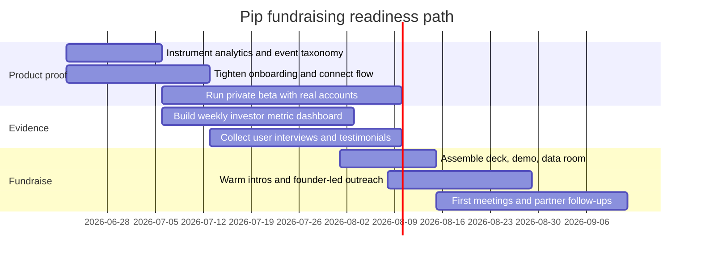

# Funding Roadmap for Pip

## Executive summary

Pip is no longer just an idea. The public repository shows a live, production-linked Next.js and TypeScript codebase with Supabase, Plaid, OpenAI Agents SDK integration, usage/event tracking routes, operator review routes, test and live-smoke scripts, and a deployed consumer-facing site at spendwithpip.com. The repo has 53 commits, 2 open draft pull requests, 0 public issues, and a visible app version of `0.1.0`. The product’s stated wedge is unusually crisp: one daily number, “Spendable Cash Today,” delivered through a chat-first flow rather than a dashboard. That is a real fundraising asset because early investors fund focus, not feature breadth. citeturn16view0turn17view0turn18view1turn24view0turn20view0

The strongest financing path for Pip is **not** a large institutional seed round right now. The highest-probability route is a **lean pre-seed process** built around proof of behavior change and subscription willingness: first, tighten the product narrative and instrument retention and activation; second, run a small private beta with real account connections; third, raise on a post-money SAFE from angels, a few fintech/consumer micro-VCs, and possibly an accelerator. Given current market benchmarks, a **$500k to $1.0m pre-seed** is the practical target band for Pip today, with **$750k** as the most balanced default. Q1 2025 PitchBook-NVCA data showed a median US pre-seed pre-money valuation of roughly **$14.0m** and a median pre-seed deal size of **$0.8m**, but Pip should likely price somewhat more conservatively unless it can show strong paid conversion and retention because consumer fintech still carries trust, compliance, and infrastructure risk. citeturn31search16turn35search0turn35search2

The real investor story is this: Pip is a **consumer fintech habit product**, not another budgeting app. The site explicitly positions it against dashboards, spreadsheets, and category guilt; the differentiator is a calm, behavior-shaping daily signal plus conversational explanations. That gives Pip a plausible angle versus YNAB, Monarch, Simplifi, PocketGuard, Copilot, and Cleo, but it also means investors will demand proof that users repeatedly **check Pip before spending** and will **pay for that behavior change**. Without that evidence, the idea risks being interpreted as a nice UX wrapper around account aggregation. citeturn24view0turn25search1turn25search2turn25search3turn39search0turn39search4turn40search1turn41view0

My bottom-line recommendation is: **raise only after you can show a disciplined private-beta scoreboard**. The minimum credible milestone set is not revenue scale; it is a coherent data room showing onboarding completion, linked-account activation, first-value speed, repeat usage, prompt engagement, sync reliability, and at least early evidence that people choose or keep a paid plan. If you can show that in the next 90 days, you will be in range for angels, Afore, Village Global, Better Tomorrow Ventures, select QED entry vehicles, YC, Techstars, and sector-specific programs like gener8tor Fintech. citeturn33search0turn32search1turn33search1turn33search2turn3search7turn3search4turn34search0

## Pip today

### Current project status

From the repository and live site, Pip appears to be at the **advanced MVP / private beta preparation** stage rather than concept stage. The codebase includes a Next.js app, Supabase-backed data foundation, Plaid integration paths, an `/api/agent` route built on the OpenAI Agents SDK and Responses API, beta usage/event logging, operator review endpoints, and explicit verification steps including unit tests, Playwright E2E, live-smoke checks, deployment checks, and production proof scripts. The marketing site is live and already selling a concrete narrative and price point. citeturn17view0turn18view1turn23view0turn24view0

There are also signs of real operating maturity for an early project. The README describes production and draft Netlify deploys, a database migration for user-scoped financial tables and row-level security, manual sync endpoints, encrypted provider token handling, and usage summaries intended for “beta cost and product-proof control.” That is materially better than a prototype with no observability. It means Pip can plausibly tell investors, “we are already building the instrumentation layer required for a disciplined beta.” citeturn17view0turn23view0

There are, however, several weaknesses investors will notice immediately. The repository shows **0 public issues** and **issue creation is restricted**, so there is little visible public roadmap signaling. I also did **not** find a visible license badge or license file on the repo page, which is fine for a proprietary startup but should be made explicit because ambiguity around licensing can create diligence friction. The two open pull requests are both still drafts, and one is a marketing SEO article rather than core product work, so the visible signal to outsiders is somewhat mixed. citeturn18view3turn19view0turn20view0

The bigger strategic issue is **provider-direction inconsistency**. The architecture decision report argues for “MockProvider first, Teller for private beta, Plaid later,” while the current README says “Plaid is the current provider direction” and notes that Teller remains in the codebase as fallback/reference. Investors will interpret this as a reasonable pivot if you explain it cleanly, but as confusion if you do not. You need one short sentence in the deck that resolves it: for example, “We validated the abstraction layer early, then standardized current beta infrastructure around Plaid for cleaner operations and better investor legibility.” citeturn21view0turn21view1turn23view0

### Value proposition

Pip’s core wedge is unusually simple: “Your bank balance is not permission to spend,” and Pip replaces that misleading heuristic with “Spendable Cash Today.” The site repeatedly emphasizes that it is **not another budget app**, avoids dashboards and menus, and lets users ask for explanations only when needed. That is a clearer story than most early consumer fintechs, which usually drown themselves in feature sprawl. citeturn24view0turn17view0

That simplicity is also strategically useful in fundraising because it enables a sharper investment memo. Pip is not arguing that consumers want more financial data. It is arguing that consumers want **less cognitive load** and a better default decision signal. Compared with YNAB’s zero-based budgeting, Monarch’s full planning/budgeting environment, Simplifi’s spending plan, PocketGuard’s “Leftover,” Copilot’s broad tracking and net-worth control, and Cleo’s personality-heavy AI assistant plus banking features, Pip is aiming at the subproblem of **pre-purchase spending clarity** with a narrower behavioral loop. citeturn25search1turn25search2turn25search3turn39search0turn39search4turn40search1turn41view0

### Target users and market

The live site makes the likely initial user profile fairly clear even though the broader business model remains an open variable. The copy targets people who already check their bank balance before spending, dislike traditional budgeting discipline, and want a calm, low-friction financial habit. It also frames Pip as read-only, non-transactional, and paid specifically so that “your money data should not be the product.” That points to an initial wedge in **consumer subscription fintech**, especially younger consumers or anxious-but-engaged users who want control without a full budgeting workflow. citeturn24view0

The top-down market is large enough. The FDIC reported that nearly **96% of U.S. households were banked in 2023**, while the Federal Reserve’s 2025 SHED found that **94% of adults had a bank account**, **59%** experienced a major unexpected expense in the prior year, and only **63%** said they could cover a $400 emergency expense with cash or equivalent. That does not prove Pip wins, but it does support the claim that a large U.S. consumer base has bank access and recurring cash-flow uncertainty. citeturn27search0turn27search1

The immediate market question is therefore not “is there a market?” but “is there a market for **this narrow habit product** at this price?” Your pricing page currently presents **$2.99/week** and **$7.99/month**. That is aggressive enough to force real willingness-to-pay evidence early, which is good for fundraising if conversion is real and bad if it is not. In other words, your current site already creates a measurable hypothesis investors will respect: can a user justify roughly **$96/year** for one trusted spending number and conversational clarity? citeturn24view0

### Competitive position

The table below is the most relevant competitive frame for investors.

| Competitor | Current positioning | What Pip can credibly say | Strategic risk to Pip |
|---|---|---|---|
| YNAB | Zero-based budgeting, “give every dollar a job,” annual or monthly subscription pricing. citeturn25search3 | “We are for people who will never become disciplined budgeters.” | If Pip expands into planning/categories, it loses contrast. |
| Monarch | Household money hub with budgeting, reporting, goals, and higher-level planning. citeturn25search1turn25search2 | “We do not want to be your home base for all money.” | Monarch can easily message “clarity” too. |
| Quicken Simplifi | Spending plan with recurring income/bills and “left this month.” citeturn39search0turn39search5 | “We default to one daily decision number, not a monthly planning canvas.” | Simplifi is closest in functional logic. |
| PocketGuard | “Leftover” amount after bills, budgets, goals, debts. citeturn39search4 | “We turn leftover into a calmer, conversational, daily habit.” | Investors may say PocketGuard already exists. |
| Copilot Money | Beautiful premium tracker for spending, budgets, investments, subscriptions, net worth. citeturn40search0turn40search1 | “We are not a wealth dashboard.” | Copilot is strong on design and paid consumer willingness. |
| Cleo | AI financial assistant with chat, savings, card, personality, and bank integration via Plaid. citeturn41view0 | “We are calmer, narrower, and more trustworthy for sober spending decisions.” | Cleo already owns part of the ‘AI money assistant’ mental slot. |

The core fundraising implication is harsh but useful: **Pip should not pitch as “AI personal finance.”** That pitch gets lost instantly. The better pitch is: **“We replace the most common bad spending heuristic with a trusted daily signal.”** The AI layer supports the product, but the product is the behavioral loop. That distinction matters because funds that pass on generic AI assistants may still like a focused consumer-fintech habit engine. citeturn24view0turn41view0

## Best funding roadmap

### The right funding instrument and amount

At Pip’s current stage, the cleanest financing instrument is a **post-money SAFE**, most likely a valuation-cap SAFE or equivalent founder-friendly early-stage instrument. YC’s SAFE documents remain the standard reference point for this type of financing, and YC’s own materials emphasize the post-money SAFE’s advantage: founders can calculate dilution more precisely and close investors incrementally. citeturn35search0turn35search2

For Pip specifically, I would frame raise size as three options:

| Raise option | Best use case | Suggested cap posture | Main downside |
|---|---|---|---|
| **$250k–$400k** | Founder-led extension to prove beta retention before serious fundraising | Lower cap, likely friendlier to angels | May underfund security/compliance and slow learning |
| **$500k–$1.0m** | Best default for Pip now; enough for 12–18 months of disciplined proof-building | Sensible pre-seed SAFE band | Requires better narrative and tighter milestones |
| **$1.0m–$1.5m** | Only if early beta converts strongly and onboarding/reliability are already compelling | Higher expectations on metrics and team completeness | Bigger dilution risk if raised too early |

My recommendation is **$750k target / $1.0m stretch / $500k floor**. That is close enough to current pre-seed deal norms to feel credible, while still acknowledging that Pip is a consumer fintech product with regulatory, data-vendor, and trust overhead. Q1 2025 US pre-seed medians were around **$0.8m deal size** and **$14.0m pre-money valuation**, but you do not need to chase the market median if your proof is still emerging. For Pip, a practical working range is roughly **$8m–$12m post-money cap** depending on the quality of early paid conversion and retention data. If the metrics are weak, it is wiser to raise smaller on a lower cap than to force a vanity valuation that makes the next round harder. citeturn31search16turn35search0

### Use of funds

If you raise around $750k, the use of funds should stay brutally narrow.

| Use of funds | Why it matters for Pip | Suggested priority |
|---|---|---|
| Product engineering | Improve activation, sync reliability, simulation accuracy, and agent UX | Highest |
| Compliance, security, and legal | Consumer fintech trust risk; vendor reviews; privacy and contract hygiene | Highest |
| Design and research | Pip’s advantage is clarity and habit formation, not raw feature count | High |
| Beta operations and analytics | You need event instrumentation and investor-grade cohort reporting | High |
| Growth experiments | Only enough to validate acquisition channels, not to scale them | Medium |
| Founding team runway | Maintain decision quality and fundraising leverage | Medium |

A good use-of-funds sentence for investors is: **“This round buys the evidence required for a credible seed, not a large team.”** If the money goes toward generalized feature expansion, you will dilute the thesis and still not answer the real investment question. citeturn23view0turn24view0turn35search0

### Traction metrics to collect before and during fundraising

Because Pip is consumer + fintech + AI-assisted, your metric stack needs to show both **behavioral pull** and **operational trust**.

| Metric category | What to track | Why investors care |
|---|---|---|
| Activation | Waitlist-to-signup, signup-to-bank-link, bank-link-to-first Spendable Cash Today view, first-value time | Proves the product is understandable |
| Engagement | DAU/WAU, weekly check frequency, share of users who ask “why did today change?” or run spend tests | Proves habit formation |
| Retention | D1, D7, D30, cohort retention after first bank sync and after first negative day | Proves this is not novelty |
| Revenue | Trial start, trial-to-paid, monthly vs weekly plan uptake, gross churn, refund rate | Proves willingness to pay |
| Trust and reliability | Sync success rate, partial sync rate, manual refresh use, institution repair rate, support tickets per active user | Proves fintech operations can scale |
| Product value | % of sessions tied to a real spending-decision moment, user-stated confidence lift, NPS after 2 weeks | Proves “one number” is actually useful |

The README already points in this direction by describing `/api/usage` and `/api/events` endpoints that summarize views, prompt-chip taps, AI questions, follow-ups, spend tests, balance reveals, provider syncs, partial syncs, and failures. That means a lot of the required measurement foundation is already designed; the task now is to turn it into an investor-facing scoreboard. citeturn23view0

### Funding timeline and milestones



The ideal milestone ladder is: **working beta → reliable usage instrumentation → early paid conversion → disciplined outreach**. Do not invert that sequence. If you start outreach before the beta metrics stabilize, you will consume warm introductions on a half-baked story. citeturn23view0turn24view0turn35search5

## What investors will expect

### Valuation approach

There are three defensible ways to talk about Pip’s valuation, and you should be ready to use all of them.

**Market-comps method.** Reference current pre-seed norms, but use them as context rather than entitlement. PitchBook-NVCA’s Q1 2025 median US pre-seed numbers of roughly **$14.0m pre-money** and **$0.8m deal size** are helpful anchors. citeturn31search16

**Dilution-budget method.** Start with how much ownership you are willing to sell now while preserving room for a seed and Series A. YC’s SAFE materials are useful here because they emphasize understanding dilution precisely in post-money terms. If you want to sell, say, high single digits to low teens now, model backwards from the capital needed. citeturn35search0

**Risk-adjusted method.** Discount from broad software medians when risk is plainly higher. Pip has real strengths, but it also has consumer acquisition risk, fintech trust risk, vendor dependency, and iteration risk around the daily-number calculation. That is why I would avoid presenting Pip as if it already deserves top-quartile AI-consumer-fintech pricing without stronger traction.

My practical guidance:

- If the next 90 days produce **solid private-beta metrics but limited revenue**, anchor around **$8m–$10m post-money cap**.
- If you show **strong early paid conversion, low support burden, and improving retention**, you can push toward **$10m–$12m**.
- If traction is soft, take the smaller round rather than stretching cap expectations.

### Term sheet terms to expect

At a pre-seed SAFE stage, expect negotiations to concentrate on cap, discount structure if any, MFN language, pro rata side letter requests, and any investor information rights. YC’s publicly available SAFE package includes standard post-money SAFE forms, an uncapped MFN SAFE, and a pro rata side letter, which is exactly why many early investors will pattern-match to those documents. citeturn35search0turn35search2

If someone pushes you into a priced seed too early, the key terms you should expect are the usual venture items reflected in NVCA’s model legal documents and related term-sheet resources: 1x liquidation preference, option-pool sizing, investor rights, voting terms, ROFR/co-sale mechanics, and board composition. NVCA’s documents remain the industry baseline, and NVCA/Aumni’s enhanced term-sheet work exists specifically to benchmark common venture terms against executed market transactions. citeturn36search0turn42search0turn42search1turn42search11

For Pip, the terms that matter most are not exotic economics; they are control and future flexibility:

- **Avoid milestone-based tranched financing** unless you absolutely need it.
- Be careful with **overly broad protective provisions** that can slow product moves.
- Limit board complexity early; a small founder-controlled board is better.
- Be very cautious about giving away **too much pro rata** to small early checks.
- Model post-SAFE dilution before signing anything.

### Due diligence checklist

A serious early-stage investor will almost certainly ask for the following categories, even if informally:

| Diligence area | What Pip should have ready |
|---|---|
| Corporate | Delaware C-corp status if applicable, formation docs, board consents, cap table, SAFEs, founder vesting |
| IP | Founder and contractor IP assignment, employment/confidentiality agreements, trademark plan, no ambiguous asset ownership |
| Product | Live demo, repo overview, architecture note, roadmap, known risks, QA/test process |
| Metrics | Cohort dashboard, funnel metrics, retention table, support volume, beta usage summary |
| Vendor/compliance | Plaid status and constraints, privacy policy, terms, data deletion flow, security roadmap, incident handling basics |
| Financial | 18-month operating model, burn, hiring plan, vendor-cost assumptions, scenario planning |

Pip’s repo already suggests some diligence positives: user-scoped financial tables, RLS, encrypted provider-token handling, delete-data flows, usage/event routes, an operator overview, and verification scripts. It also highlights diligence gaps you should close explicitly: public roadmap hygiene, clear financing narrative around Plaid vs Teller, and formal legal/compliance packaging rather than buried implementation notes. citeturn23view0turn22view2turn36search0

For fintech specifically, investors will also ask how exposed you are to platform and compliance dependencies. Plaid’s docs make clear that access to production data is governed by plan structure, and its newer Trial plan is free but capped at **10 Production Items**; longer-term production pricing depends on plan and product mix. CFPB’s personal financial data rights rule is also still in flux, with compliance dates stayed in litigation and possible amendments under discussion. That means you should present vendor and regulatory exposure as active management items, not settled infrastructure assumptions. citeturn28search0turn28search1turn38search2

## Where to target investors and alternatives

### Investor types to target

| Investor type | Best use for Pip | Check size / terms pattern | Fit now |
|---|---|---|---|
| Angels | First conviction money, fast decisions, fintech/product advice | $25k–$150k typically; SAFE | **Very high** |
| Micro-VCs | Lead or anchor a real pre-seed | Often $250k–$1m+ combined; SAFE or light seed docs | **Very high** |
| Accelerators | Capital + signal + network + fundraising structure | Standard accelerator terms | **High** |
| Sector VCs | Helps if they truly invest at pre-seed, not just say they do | Variable; may want more proof | **Medium** |
| Corporate programs | Distribution and credibility after PMF or early revenue | Usually later-stage or strategic | **Low now / higher later** |
| Grants | Only if you reframe as novel infra/security/R&D | Non-dilutive | **Low-to-medium** |

### Prioritized outreach list

This list is ordered by practical fit for the next round, not by prestige alone.

| Priority | Investor / program | Why it fits Pip | Evidence |
|---|---|---|---|
| Very high | **Afore Capital** | Explicit pre-seed focus; invests before traction; software-friendly; quick decision culture. | citeturn32search1turn32search4 |
| Very high | **Village Global** | Leads pre-seed and seed; invests pre-revenue; network value is strong for future rounds. | citeturn32search0turn32search3 |
| Very high | **Better Tomorrow Ventures** | Fintech-specialist brand with strong operator credibility; compelling category fit. | citeturn33search1 |
| High | **Y Combinator** | Standardized seed capital, strong signal, high-quality fundraising acceleration. | citeturn3search2turn3search7turn35search0 |
| High | **Techstars** | Structured accelerator path; broad network; some programs fit AI/workforce/consumer-ish companies depending cohort. | citeturn3search4turn3search8turn3search11 |
| High | **gener8tor Fintech** | Fintech-specific accelerator infrastructure; explicit cash terms and partner access. | citeturn34search0turn34search3 |
| Medium | **QED Investors** | Excellent fintech credibility; does invest across stages including pre-seed, but main early-stage check sizes are often larger and the bar is higher. | citeturn33search2 |
| Later | **Mastercard Start Path** | Strong for scale and partnerships, but explicitly wants product live, revenue, and seed/Series A or later; not ideal for current stage. | citeturn34search1 |

A practical outreach rule: **do not send the same story to all of them**. Afore and Village need to believe in founder judgment and wedge clarity. BTV and QED need to believe in fintech category insight and long-term defensibility. YC and Techstars need to believe the product can move fast enough to show sharp week-over-week learning. citeturn32search1turn32search0turn33search1turn33search2turn3search5

### Networking and accelerator options

For accelerators, the clearest current paths are YC, Techstars, and gener8tor Fintech. YC’s current application materials and standard deal are fully public. Techstars’ public accelerator pages and application cycle materials show current program scheduling and sector variance. gener8tor’s fintech programs are more directly verticalized and can be attractive if you want sector access without pretending you are further along than you are. citeturn3search2turn3search7turn3search4turn34search0turn34search3

For corporate networking, Mastercard Start Path is worth tracking but not targeting yet. Their own stage criteria say they want a unique and proven solution, product live in market, and companies at seed, Series A, or later with revenue. For Pip, that makes it a **post-pre-seed target**, not a current one. citeturn34search1

### Alternative funding paths

| Funding path | When it makes sense for Pip | Recommendation |
|---|---|---|
| Revenue-first | If beta users convert and churn is manageable | **Strongly recommended** as proof layer even if you still raise |
| Accelerators | If you want external structure and stronger network leverage | **Recommended** |
| Grants | If you can frame core work as novel data portability, security, or AI/system research | **Only selectively** |
| Crowdfunding | If you want brand/community proof | **Low fit** for financial-trust product |
| Strategic partnerships | If a financial institution, employer, or financial-wellness channel wants pilots | **Potentially strong later** |

Crowdfunding is possible but not ideal. Pip’s product promise depends on trust, reliability, and financial seriousness; crowdfunding is worse than a beta waitlist for proving that. Grants are similarly weak unless you explicitly reposition part of the work as novel technical infrastructure. Revenue, on the other hand, is unusually valuable for Pip because the live site already states clear subscription prices. If users pay even at small scale, that tells investors the simplicity is not just aesthetically appealing; it is commercially legible. citeturn24view0turn34search1

## Ninety-day plan and templates

### Prioritized action plan

#### First month

- Resolve the **provider narrative** in one sentence across README, deck, and demo. Current public documents show mixed Teller/Plaid direction. citeturn21view0turn23view0
- Turn `/api/usage` and event logging into a founder dashboard with weekly cohort reporting. citeturn23view0
- Instrument the exact activation funnel: signup, link, consent, first value, first “Ask Pip” event, first return session. citeturn23view0turn24view0
- Close legal hygiene gaps: confirm company docs, IP assignment, contractor paperwork, cap table readiness, and make the repo’s licensing posture explicit. citeturn19view0turn36search0
- Build a **tight 3-minute demo**: bank connect, first number, “Can I spend $50?”, “Why did today change?” and one reliability/repair example. citeturn24view0turn17view0

#### Second month

- Run a real private beta with enough users to produce cohort data, not anecdotes.
- Aim for measurable milestones such as:
  - 40–60 linked-account beta users
  - 70%+ signup-to-bank-link completion among qualified testers
  - 50%+ week-two retention among linked users
  - clear statement of paid trial start and conversion rate
- Collect structured qualitative evidence: why users opened Pip, when they checked it, whether it prevented a purchase, whether they trusted the number. citeturn24view0turn27search1

#### Third month

- Freeze a **fundraising data room**.
- Start with angels and the top three micro-VC fits.
- Use accelerator applications as parallel optionality, not as the only plan.
- Target 25–40 high-quality outbound investor touches, mostly through warm intros.
- Measure process health: meeting-to-second-meeting rate, partner-meeting rate, and reasons for pass.

### Suggested pitch deck outline

| Slide | What it should do |
|---|---|
| Title | Pip in one sentence: “A calmer way to know what you can actually spend today.” |
| Problem | Bank balance is a bad spending heuristic; consumers use it anyway. |
| Why now | AI-native interface expectations + data connectivity + post-Mint reset in consumer finance. |
| Product | Show Spendable Cash Today and one conversational explanation flow. |
| User insight | What target users hate about budgeting apps; what they want instead. |
| Market | Large banked US consumer base with recurring cash-flow stress. |
| Why Pip wins | One-number wedge, chat-first UX, read-only trust layer, paid alignment. |
| Traction | Beta funnel, retention, usage, paid conversion, testimonials. |
| Business model | Weekly/monthly paid consumer subscription; optional future variants if relevant. |
| Competition | Pip vs YNAB/Monarch/Simplifi/PocketGuard/Copilot/Cleo. |
| Go-to-market | Initial channels, waitlist, creator/word-of-mouth loops, beta learnings. |
| Ask | Amount, runway, milestones this round funds, why now. |

### Outreach strategy

The best sequencing is:


Do not blast full decks cold to everyone at once. Use a short note first, then send the deck when there is at least light interest. For Pip, the first call should stay close to **problem, wedge, habit, and proof**, not banking-infrastructure minutiae unless the investor pulls you there. citeturn3search5turn35search0

### Sample investor email templates

```text
Subject: Pip — one daily number that replaces the bank-balance guess

Hi [Name],

I’m building Pip, a chat-first consumer fintech product that gives users one number: what’s actually safe to spend today.

The thesis is simple: people already check their bank balance before spending, but that number is misleading. Pip replaces it with “Spendable Cash Today” and explains changes only when asked.

We’ve already built the live product foundation: account connection, usage instrumentation, agent flows, and beta operations. We’re now running private-beta proof on activation, repeat usage, and paid conversion.

I think this fits your interest in [consumer fintech / habit products / pre-seed software]. If relevant, I’d love to send a short deck and a 3-minute demo.

Best,
Tyler
```

```text
Subject: Intro request — Pip

Hi [Mutual Contact],

Could you introduce me to [Investor]?

I’m building Pip, a paid consumer fintech app built around one behavior-changing metric: “Spendable Cash Today.” The wedge is intentionally narrow — before a purchase, users check Pip instead of guessing from their bank balance.

Why I think the fit is strong:
- [Investor/Firm] backs early fintech or consumer products
- we’re raising a lean pre-seed to prove retention, trust, and paid conversion
- the product is already live enough to demo clearly

Blurb you can forward:
“Tyler is building Pip, a calmer alternative to budgeting apps. Pip gives users one trusted daily number — what they can actually spend today — and explains changes through chat. He’s preparing a disciplined pre-seed around beta usage and conversion proof.”

Thanks,
Tyler
```

### Measurable ninety-day milestones

| Milestone | Target |
|---|---|
| Qualified beta users with linked accounts | 40–60 |
| Signup-to-bank-link conversion | At least 70% among qualified beta users |
| First-value time | Under 10 minutes from signup for most users |
| D7 retention for linked users | At least 35–40% |
| D30 retention for linked users | At least 20–25% |
| Paid trial start rate | Enough to show non-zero willingness to pay; ideally double digits |
| Sync success rate | 95%+ on healthy institutions |
| Support burden | Low enough that trust and onboarding issues look fixable, not systemic |
| Investor shortlist built | 30–40 names, with at least 10 warm paths |
| Deck/data room/demo complete | Finished before outreach wave begins |

These are not universal startup thresholds. They are the kind of numbers that make a **focused pre-seed conversation** possible for a product like Pip.

## Open questions and limitations

Some important variables remain open, and they matter:

- **Actual traction is unknown.** I could not verify active-user counts, retention cohorts, waitlist size, revenue, or paid conversion from public sources.
- **Legal structure and cap table are unknown.** Those will matter in diligence.
- **The licensing posture is unclear publicly.** I did not find a visible license badge or file on the public repo page, which is fine if intentional but should be clarified. citeturn19view0turn19view1
- **The current provider roadmap needs one canonical version.** Public docs still show some Teller/Plaid tension. citeturn21view0turn23view0
- **Grant fit is uncertain.** If Pip remains a straightforward consumer app, grants are a low-probability path; if it develops genuinely novel privacy, security, or financial-data portability infrastructure, that changes.
- **Geography is still an open variable.** The repo and site are U.S.-oriented today, and the current Plaid trial and compliance context are U.S./Canada-specific. citeturn28search0turn28search1turn38search2

The short version: **Pip is fundable at pre-seed if you raise on proof, not promise.** The codebase and live site are already good enough to justify a serious private-beta sprint. The next round should be used to prove that users will repeatedly trust, use, and pay for the single-number habit — because if that becomes true, the simplicity that looks risky today becomes the moat.